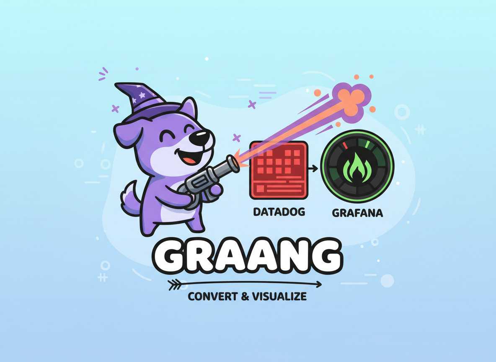
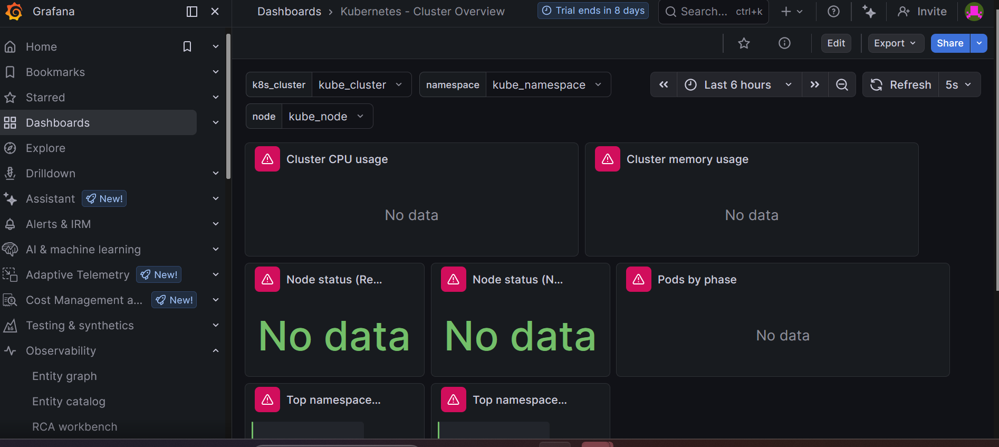

<p align="center">
  
</p>

# graang - Modern Datadog to Grafana Dashboard Converter

**graang** is a lightweight, zero-dependency Python tool for converting Datadog dashboard schemas to Grafana dashboard schemas. Built as a modern replacement for the discontinued Grafana Labs converter.

## What's Included

- **Dashboard Converter** - Convert Datadog dashboards to Grafana format with a single command
- **Dashboard Analyzer** - Examine dashboard structure, widgets, queries, and template variables
- **Demo Examples** - Real-world Kubernetes dashboard conversion examples in the `DEMO/` folder
- **Comprehensive Tests** - Full test suite with 87%+ conversion success rate

## Motivation & Project Background

**IMPORTANT: This project was initiated and developed by the author and contributor of this repository.**

### Replacing the Discontinued Grafana Labs Tool

**graang** was created as a modern replacement for the Grafana Labs Datadog-to-Grafana converter, which is no longer supported. The original tool became obsolete as both platforms evolved their dashboard schemas and features.

This project demonstrates that the core challenge in dashboard migration is **schema translation** - understanding and mapping between two completely different JSON structures, query languages, and visualization systems.

### AI-Assisted Development at Fidelity

This project was originally developed at **Fidelity** as an example of **AI-assisted code practices** using tools like **Microsoft Copilot** and other AI assistants. The goal was to demonstrate how AI can accelerate the development of practical observability utilities for modern cloud-native environments.

**Key learnings:**
- AI assistance significantly speeds up schema mapping and translation logic
- Automated test generation ensures reliability
- Rapid iteration on complex JSON transformations
- Modern development practices (type hints, validation, security)

### Current Status

- **Version:** 0.1.0 (Alpha)
- **Purpose:** Production-ready dashboard migration tool
- **Maintenance:** Active development
- **License:** MIT

## Features

### Dashboard Analysis
- Complete dashboard structure analysis
- Identification of all widgets and nested widgets
- Query extraction and categorization
- Metric source tracking
- Template variable analysis
- Visualization type identification
- Hierarchical display of dashboard components
- Support for both modern and legacy Datadog dashboard formats

### Dashboard Conversion
- Convert Datadog dashboards to Grafana JSON format
- Support for multiple widget types (timeseries, query_value, toplist, note, heatmap, etc.)
- Template variable conversion (preserves all variables with defaults)
- Layout preservation with grid positioning
- **Note:** Queries are preserved but require manual translation from Datadog to Prometheus format
- Automatic query translation feature is under development
- You may need to adjust datasource UIDs in the converted dashboard to match your Grafana setup
- The code includes the original DatadogDashboard class for parsing, so it's fully self-contained
- The conversion maintains the overall dashboard layout structure

## Technical Highlights

### Zero Dependencies
- Pure Python standard library only
- No external runtime dependencies
- Easy to deploy in restricted environments

### Security First
- Input validation and sanitization
- Path traversal prevention
- JSON depth limiting (prevents resource exhaustion)
- File size limits (50MB max)

### Modern Python Packaging
- Proper src-layout structure
- Type hints throughout (PEP 484)
- Modern pyproject.toml configuration
- Installable via pip
- CLI entry points (`graang`, `graang-analyze`)

### Quality Assurance
- Comprehensive test suite (1,290+ lines)
- Type checking with mypy
- Code formatting with Black
- Linting with flake8
- 87%+ conversion success rate

### Grafana Schema v36
- Supports latest Grafana dashboard format
- Modern panel types (timeseries, stat, bargauge, etc.)
- Template variable system
- Grid layout positioning


## Use Cases

- Analyze dashboard complexity before migration
- Identify commonly used metrics across dashboards
- Review query patterns for optimization
- Prepare for dashboard migrations between monitoring systems
- Document dashboard structure for compliance or knowledge transfer

## Quick Start: Convert a Kubernetes Dashboard

Convert any Datadog dashboard to Grafana in one command:

```bash
graang your-datadog-dashboard.json your-grafana-dashboard.json
```

### See It In Action

Check out the `DEMO/` folder for a complete real-world example:

```bash
cd DEMO
cat README.md  # Read the full conversion walkthrough
```

The demo includes:
- **Original Datadog Dashboard** - Kubernetes cluster overview with 8 widgets
- **Converted Grafana Dashboard** - Ready to import (7/8 widgets converted successfully)
- **Detailed Documentation** - Complete explanation of the schema translation process

**Conversion command used:**
```bash
graang DEMO/k8s-cluster-overview-datadog.json DEMO/k8s-cluster-overview-grafana.json
```

**Result:** 87.5% success rate (7/8 widgets), converted in seconds!

## Installation

### Option 1: Run Without Installation (Recommended)

The easiest way to use **graang** is with the provided executable wrappers:

```bash
# Clone the repository
git clone https://github.com/ncandio/graang.git
cd graang

# Run directly - no installation needed!
./graang input_datadog_dashboard.json output_grafana_dashboard.json
./graang-analyze your_dashboard.json
```

### Option 2: Install from Source

```bash
pip install -e .
```

### Option 3: Install with pipx (System-wide)

```bash
pipx install .
```

## Usage

### Dashboard Conversion

**Using the executable wrapper (no installation required):**

```bash
./graang input_datadog_dashboard.json output_grafana_dashboard.json
```

**After pip installation:**

```bash
graang input_datadog_dashboard.json output_grafana_dashboard.json
```

**Or run as Python module:**

```bash
python -m graang.datadog_to_grafana input_datadog_dashboard.json output_grafana_dashboard.json
```

### Dashboard Analysis

**Using the executable wrapper (no installation required):**

```bash
# Analyze dashboard structure and print detailed report
./graang-analyze your_dashboard.json

# Convert dashboard to Grafana format
./graang-analyze your_dashboard.json -c -o output_dashboard.json
```

**After pip installation:**

```bash
graang-analyze your_dashboard.json
```

**Or run as Python module:**

```bash
python -m graang.datadog_dash_translator your_dashboard.json
```

**Additional options for dashboard analysis:**
- `--grafana-folder`: Specify Grafana folder name for converted dashboard (default: Converted)
- `--datasource`: Specify Grafana datasource name (default: prometheus)
- `--time-from`: Dashboard time range from (e.g., now-6h)
- `--time-to`: Dashboard time range to (e.g., now)

## DEMO - Real-World Kubernetes Dashboard Conversion

The `DEMO/` folder showcases a complete end-to-end conversion of a production Kubernetes monitoring dashboard from Datadog to Grafana Cloud.

### What's in the DEMO

- **k8s-cluster-overview-datadog.json** - Original Datadog dashboard (6.3 KB)
  - 8 widgets monitoring cluster health
  - 3 template variables (cluster, namespace, node)
  - CPU, memory, pod status, and event monitoring

- **k8s-cluster-overview-grafana.json** - Converted Grafana dashboard (9.5 KB)
  - 7 widgets successfully converted (87.5% success rate)
  - All template variables preserved
  - Ready to import into Grafana

- **README.md** - Detailed conversion walkthrough explaining:
  - Schema translation complexity
  - Widget type mapping
  - Layout preservation
  - Query conversion approach

### Conversion Results

**Command used:**
```bash
./graang DEMO/k8s-cluster-overview-datadog.json DEMO/k8s-cluster-overview-grafana.json
```

**Success rate:** 7/8 widgets (87.5%)

### Deployed to Grafana Cloud

The converted dashboard was successfully imported and deployed to **Grafana Cloud**:

<p align="center">
  
</p>

*Kubernetes Cluster Overview dashboard running live in Grafana Cloud after conversion*

### Important Note: Query Translation

⚠️ **Current Limitation:** At this time, **graang does not automatically translate queries**. The tool performs schema conversion (widgets, layouts, variables), but **queries must be manually adjusted** to work with your Prometheus/Loki datasources.

**What needs manual adjustment:**
- Metric names (Datadog → Prometheus format)
- Label syntax and filtering
- Aggregation functions
- Time range specifications

**Coming Soon:** 🚀 An **automatic query translation feature** is currently under development and will be released in a future version.

### Additional Examples

The `examples/` directory contains more sample dashboards:

- `examples/k8s_dashboard.json` - Sample Kubernetes dashboard in Datadog format
- `examples/converted_k8s_dashboard.json` - Converted to Grafana format
- `examples/demo.sh` - Interactive demonstration script
- `examples/kubernetes_example.md` - Detailed example documentation

## Project Structure

```
graang/
├── src/graang/              # Main package
│   ├── __init__.py         # Package initialization
│   ├── datadog_to_grafana.py   # Main conversion logic
│   ├── datadog_dashboard.py    # Dashboard parser
│   ├── datadog_dash_translator.py  # Analyzer CLI
│   ├── utils.py            # Utility functions
│   ├── errors.py           # Custom exceptions
│   ├── validation.py       # Input validation
│   └── logging_config.py   # Logging setup
├── tests/                  # Test suite (1,290 lines)
├── DEMO/                   # Real-world conversion example
├── examples/               # Additional examples
├── images/                 # Project images/logos
└── pyproject.toml          # Modern packaging config
```

## Development

### Setting up the environment

1. Clone the repository:
   ```bash
   git clone https://github.com/ncandio/graang.git
   cd graang
   ```

2. Install in development mode with all dependencies:
   ```bash
   pip install -e ".[dev]"
   ```

   This installs:
   - pytest & pytest-cov (testing)
   - black (code formatting)
   - flake8 (linting)
   - mypy (type checking)
   - isort (import sorting)

### Running Tests

```bash
# Run all tests with coverage
pytest tests/ -v --cov=graang --cov-report=term-missing

# Run specific test file
pytest tests/test_datadog_to_grafana.py -v

# Run with the provided script (if pytest is installed)
python run_tests.py
```

The test suite validates:
- Dashboard conversion functionality (7 widget types)
- Template variable handling
- Query transformation (Datadog → Prometheus)
- Grid layout calculations
- Error handling and validation
- Security checks (path traversal, JSON depth, file size)

## Contributing
- This is an alpha version of the software. Contributions, bug reports, and feature requests are welcome.
- When contributing code, please make sure to add appropriate tests.


## License

   MIT License
